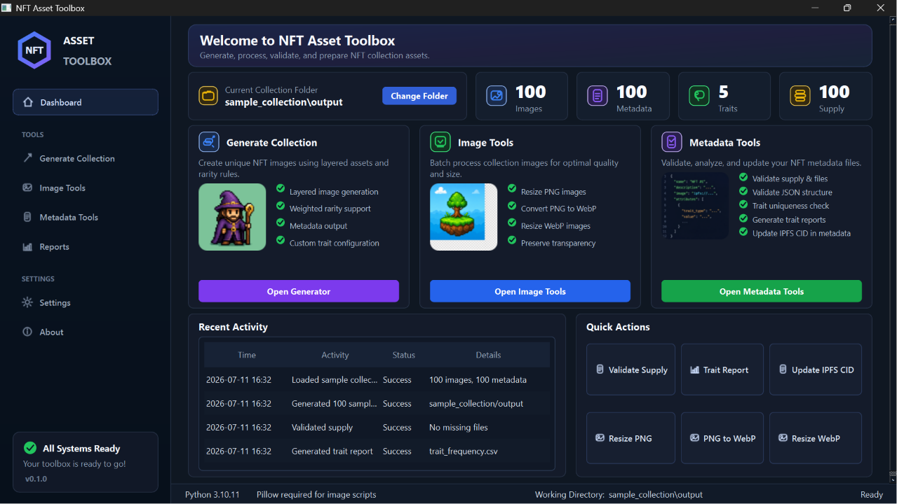

# NFT Asset Toolbox

NFT Asset Toolbox is a Python toolkit for generating, processing, validating, and preparing NFT collection assets.



## Features

- Desktop dashboard for navigating and running NFT asset tools
- Image, metadata, trait, and supply stats
- Metadata validation and report output
- Image resize and WebP conversion tools
- Generator tools for layered assets and ERC-721 metadata
- Small sample collection for local testing
- Existing CLI scripts remain available in `generator/`, `image/`, and `metadata/`

## Desktop UI

Install dependencies:

```bash
python -m pip install -r requirements.txt
```

Run the app:

```bash
python run.py
```

## Project Structure

- `nft_asset_toolbox/` - PySide6 desktop app and shared validation helpers
- `generator/` - layered asset and metadata generation scripts
- `image/` - batch image processing scripts
- `metadata/` - validation, trait report, and IPFS metadata scripts
- `sample_collection/` - small demo collection for local use
- `tests/` - pytest coverage for validation behavior

## Tests

```bash
python3 -m pytest tests/ -q
```

## Tech Stack

- Python 3
- PySide6
- Pillow
- JSON
- pytest

## Notes

- The desktop UI is designed for local collection asset workflows.
- Generated reports and output folders are ignored by default.
- The CLI scripts can still be run directly for focused batch operations.

## License

MIT
